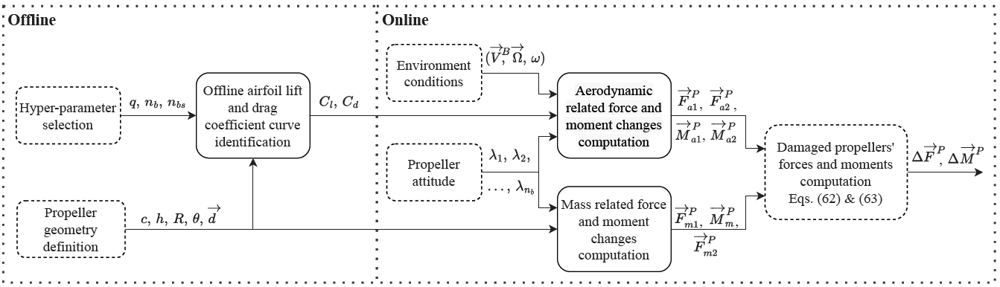

<!--http://web.archive.org/web/20111010053227/http://jaynes.colorado.edu/PythonGuidelines.html#module_formatting-->
# Blade_damage


This work proposes a white-box blade damage model based on Blade Element
Theory (BET) which combines the emerging mass and aerodynamic effects of blade damage. The model
serves as plug-in to the nominal system model, enables the simulation of any degree of blade
damage and does not require costly experimental data from failure cases. 

The repository contains Python code for:
- the identification of the airfoil lift and drag coefficient polynomials of drone blades
- the computation of the forces and moments generated by the (damaged) propeller with BET theory

## Motivation
From fault-tolerant control to failure detection, blade damage simulation has been an
essential tool for the development and testing of failure resilient modern unmanned aerial
vehicles before their entry into service. Previous literature in the field of fault diagnosis have exploited simplifications of the simulation of blade damage.
[Avram et al.](https://papers.phmsociety.org/index.php/phmconf/article/view/2504) consider quadrotor actuator faults, such as structural damage to the propellers or degradation of the
rotors, as partial loss of effectiveness — a partial loss of thrust generated by the damaged rotor. This is simulated
by multiplying the commanded rotor angular velocity by a factor lower than one in order to obtain the "true" rotor
angular velocity. The main drawback of this approach is that vibrations in the system due to the unbalance of forces and
moments are ignored.

Another approach is proposed by [Ghalamchi et al.](https://ieeexplore.ieee.org/document/8868202), which introduce sinusoids in the force signals to simulate
the vibrations caused by the propeller unbalance. The sinusoids only consist of the decomposition of the centrifugal
force in the x and y components caused by the displacement of the propeller centre of gravity due to blade damage.
Unfortunately, this approach does not consider the vibrations in the moment signals, as well as the vibrations caused by
the changed aerodynamics due to the displacement of the centre of pressure.

The development of more accurate blade damage models could contribute to the creation of more realistic simulations
that will foster the potential discovery of emerging subtle data features able to improve the current UAV on-board
failure detection and diagnosis capabilities. A technique that has been used for the modelling of forces and moments in
[helicopters](https://www.cambridge.org/us/universitypress/subjects/engineering/aerospace-engineering/principles-helicopter-aerodynamics-2nd-edition-1?format=HB&isbn=9781107013353), 
[UAVs](https://arc.aiaa.org/doi/10.2514/6.2010-7635) and [wind turbines](https://onlinelibrary.wiley.com/doi/book/10.1002/9781119992714)
 is Blade Element Theory (BET). Here, the propeller is discretised
radially into a finite number of segments of length 𝛿𝑟, each producing a differential thrust and torque. BET is based
on the assumption that the wrenches generated by a (rotor) blade can be computed by the addition of the individual
contributions of each of its span-wise elements. For this purpose, 2D airfoil characteristics are exploited whereas 3D
effects are ignored. Previously, this approach has been used [to model propeller thrust](Propeller Thrust and Drag in Forward Flight). 
However, it has never been explored for blade damage modelling.

In this repository, a white-box blade damage simulation model based on Blade Element Theory that complements the
identified healthy UAV model is implemented. To this end, the developed approach provides
the difference in forces and moments with respect to the nominal system. In contrast with existing methods, the effects
from both shifts in the centres of gravity and pressure are considered. The approach allows the injection of any level of
failure without the need of added costly and dangerous system identification experiments. To the author’s knowledge,
this is the first time BET is used for UAV blade damage simulation and the first time mass and aerodynamic effects are
modelled together in order to shift research towards more realistic white-box blade damage models. Furthermore, this
code also presents a method for identifying the (mostly unknown) UAV blade lift and drag curves with respect to the
angle of attack using BET, an approach never tried before in literature.

## Code structure
The project contains the following files:

* *main.py*: Provides the code for testing the main capabilities of the Blade damage model and the generation of the 
figures used in the thesis and paper. Basic code to compute the generated moments and forces due to propeller damage.

* *user_input.py*: Provides all the inputs that the user can modify in one centralised file.

* *Propeller.py*: Propeller holds all the information related to the propeller assembly as a whole and contains a list with all the
Blade objects that define the Propeller. It is used for calling methods applicable to all the blades which are required
for the computation of the Propeller center of gravity, as well as the moments and forces generated by the Propeller. 
Additionally, it updates the rotation state of the propeller; carries out the identification of the lift and drag
coefficient polynomials by equating the thrust and torque computed with BEM and the Matlab model identified in the
wind tunnel (using an average rotation or a single time instance); computes the uniform and linear inflow field.

* *Blade.py*: Blade holds all the information related to a single blade and contains a list with all the BladeSection objects that
define the Blade. It is used for calling methods applicable to all the BladeSections which are required for the
computation of the Blade center of gravity, blade area and mass, as well as the moments and forces generated by the
Blade. Additionally, it computes the contribution for the identification of the lift and drag coefficient relative to a
single blade.

* *BladeSection.py*: Provides the BladeSection, class for the aerodynamic model identification and computation of forces and moments.
BladeSection holds all the information related to a single blade element according to BEM theory. It is used for the
computation of the angle of attack and velocity seen by each BladeSection. Additionally, it computes the contribution
of the BladeSection lift and drag to the thrust force and torque.

* *helper_func.py*: Provides the helper functions, workhorse of the whole blade damage implementation
It contains functions that carry out simple mathematical/geometrical computations, implements the gray-box aerodynamic 
matlab model, implements the airfoil lift and drag coefficient identification, the computation of forces and moments as
a function of time, and all the plotters.

* *Gradient_descent_efficiency.py*: Provides the procedural code that demonstrates the superiority of the custom made
gradient-descent approach when compared to Nelder-Mead optimization.

* *aero_data.py*: Provides aerodynamic data of the Bebop2 gray-box aerodynamic model identified in the wind tunnel at 
TUDelft. It contains the aerodynamic parameters for the Matlab model computations

* *ClCd_plotter.py*: Provides the procedural code to plot the airfoil lift and drag coefficient curves with respect
to the angle of attack.

* *Polar_plots.py*: Provides the procedural code that show the effect of drone moving velocity on the angle of attack 
of the blade (advancing vs retreating blades), the effects of the induced velocity (model) on the angle of attack and 
the effect of the propeller rotational velocity on the angle of attack.

* *V-T_plot.py*: Provides the procedural code to generate the Velocity vs Thrust plot that demonstrates the correctness 
of thein-house developed gradient descend algorithm for computing the induced velocity.

To start using the code you can download the required Python libraries stored within _requirements.txt_. For that purpose,
it is as simple as running the following command within the command line:
```shell script
pip install -r requirements.txt
```
Then adjust the parameters that you deem necessary in _user\_input.py_ and run _main.py_.

You can also run it within Google Colab. For that you only copy-paste two lines. First:
```shell script
!git clone https://github.com/joigalcar3/Blade_damage
```
This will clone the repository. Then you can open the _user\_input.py_ file and alter the user input. Second, run:
```shell script
!python Blade_damage/main_general.py
```

## Assumptions
Next are listed the assumptions taken for the drag and lift coefficient coefficients polynomial curve
identification and the computation of the moments and forces of the propeller.

Assumptions:
- Homogeneous mass along the blade: the centroid equals the location of the cg
- The Bebop 2 blades are simplified as two trapezoids with parallel sides connected by the long parallel side
- The twist decreases linearly from the root to the tip
- The airfoil is constant throughout the blade
- The cross flow along the span of the blade is ignored
- Aeroelasticity effects are ignored
- The root and tip losses are ignored
- The induced velocity is computed with the simplified linear induced inflow
- The nonlinear effects between (damaged) blades are not considered
- The nonlinear aerodynamic effects between propellers are not considered.
- The nonlinear aerodynamic effects between the propellers and the body frame are not considered
- The data used for the cl cd identification is obtained from the Matlab model that provides the propeller thrust
- The blade is cut parallel to the edge of the propeller such that the remaining polygon is still a trapezoid

## Implementation, results and conclusions
The results of this work can be found in the author's Master thesis and paper:

- Master thesis: "From Data to Prediction: Vision-Based UAV Fault Detection and Diagnosis". Chapters 9.1-9.3, 
Appendices A-D.
- Paper: "Blade Element Theory Model for UAV Blade Damage Simulation". Everything except "VII. Model Validation."

These documents explain:
* Force and moment contribution of the mass effects
* Force and moment contribution of the aerodynamic effects
* Airfoil lift and drag coefficient identification
* Effects of the linear induced velocity model

[comment]: <> (Here are the main results from this project. They are divided between those results corresponding to the )
[comment]: <> (identification of the lift and drag coefficients polynomials and the vibrations caused by the modified location)
[comment]: <> (of the center of gravity and aerodynamics upon blade damage.)

[comment]: <> (### Lift and drag coefficients Bebop 2 identification)
[comment]: <> (<!--https://www.codecogs.com/latex/eqneditor.php-->)
[comment]: <> (Next are the identified lift and drag curves. Using the default parameters in *user_input.py*, the lift coefficient)
[comment]: <> (polynomial has the following form: )

[comment]: <> (In the case of the drag coefficient polynomial, it has the following form:)

[comment]: <> (Here is the resulting lift coefficient curve with respect to the angle of attack:)

[comment]: <> (Here is the resulting drag coefficient curve with respect to the angle of attack:)

[comment]: <> (### Resulting forces and moments)

## Contact
Hope you enjoy the code!! For any questions, comments or suggestions, 
please reach out to me at [jialvear@hotmail.com](jialvear@hotmail.com).

[comment]: <>(> [**Blade Element Theory Model for UAV Blade Damage Simulation**](http://arxiv.org/abs/2004.01177)
[comment]: <>(> José Ignacio de Alvear Cárdenas, Coen de Visser,)
[comment]: <>(> *AIAA technical report ([arXiv 2004.01177](http://arxiv.org/abs/2004.01177) 


    @inproceedings{dealvear2024BET,
      title={Blade Element Theory Model for UAV Blade Damage Simulation},
      author={de Alvear Cárdenas, J.I. and de Visser, C.},
      booktitle={AIAA Scitech 2024 Forum},
      year={2024}
    }
