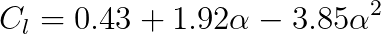
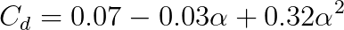
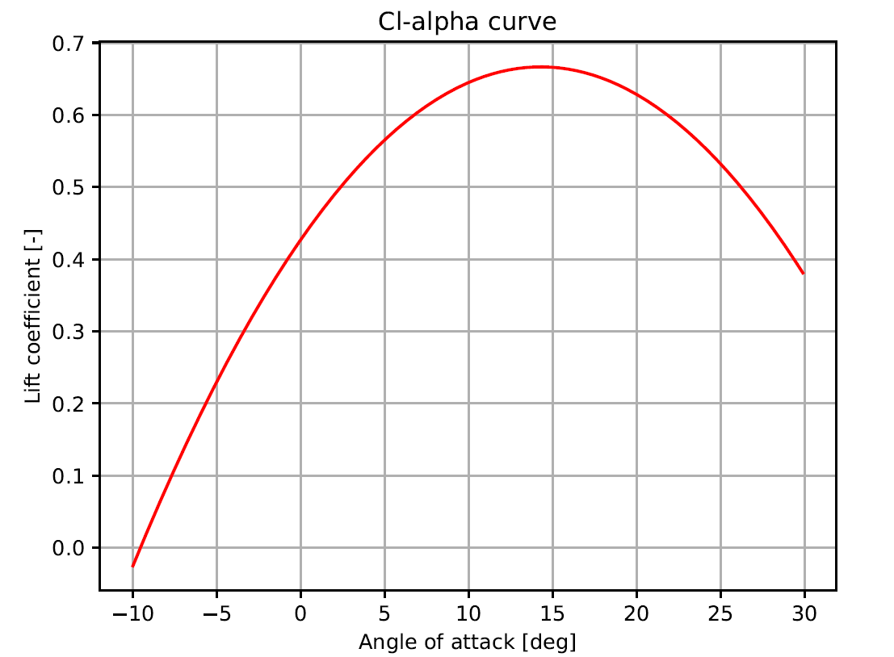
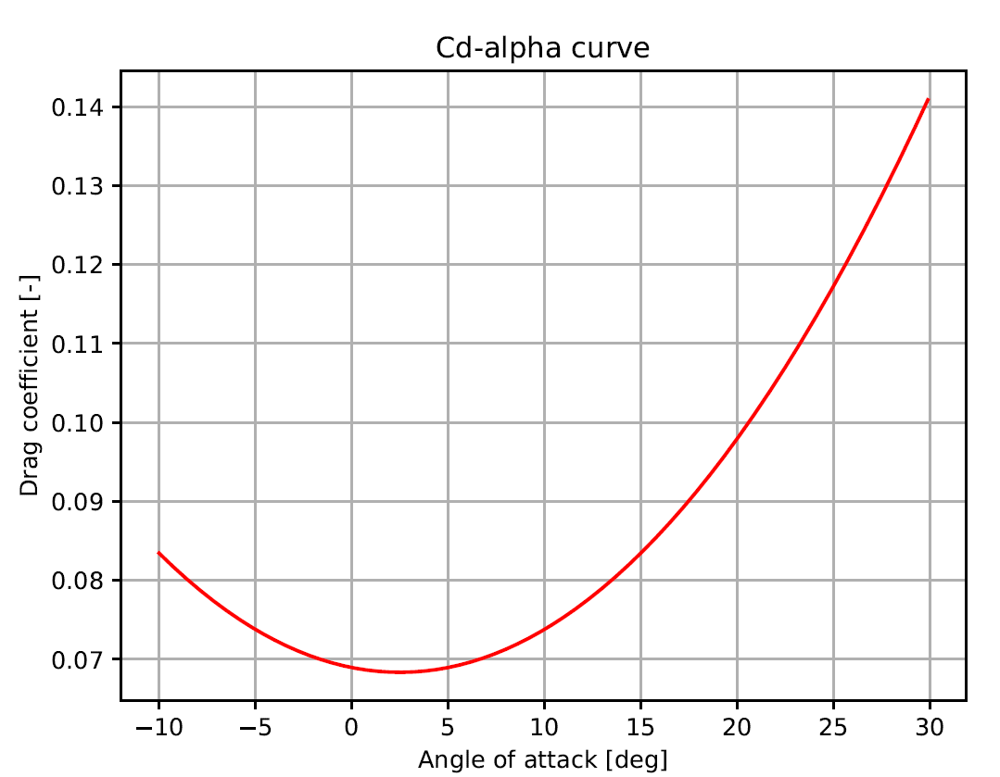

<!--http://web.archive.org/web/20111010053227/http://jaynes.colorado.edu/PythonGuidelines.html#module_formatting-->
# Blade_damage
Python code use for the identification of the lift and drag coefficient polynomials of the drone blades, as well as 
the computation of the forces and moments generated by the (damaged) propeller with BEM theory.

The project contains the following files:

* *main.py*: Provides the code for testing the main capabilities of the Blade damage model and the generation of the 
figures used in the thesis and paper. Basic code to compute the generated moments and forces due to propeller damage.

* *user_input.py*: Provides all the inputs that the user can modify in one centralised file.

* *Propeller.py*: Propeller holds all the information related to the propeller assembly as a whole and contains a list with all the
Blade objects that define the Propeller. It is used for calling methods applicable to all the blades which are required
for the computation of the Propeller center of gravity, as well as the moments and forces generated by the Propeller. 
Additionally, it updates the rotation state of the propeller; carries out the identification of the lift and drag
coefficient polynomials by equating the thrust and torque computed with BEM and the Matlab model identified in the
wind tunnel (using an average rotation or a single time instance); computes the uniform and linear inflow field.

* *Blade.py*: Blade holds all the information related to a single blade and contains a list with all the BladeSection objects that
define the Blade. It is used for calling methods applicable to all the BladeSections which are required for the
computation of the Blade center of gravity, blade area and mass, as well as the moments and forces generated by the
Blade. Additionally, it computes the contribution for the identification of the lift and drag coefficient relative to a
single blade.

* *BladeSection.py*: Provides the BladeSection, class for the aerodynamic model identification and computation of forces and moments.
BladeSection holds all the information related to a single blade element according to BEM theory. It is used for the
computation of the angle of attack and velocity seen by each BladeSection. Additionally, it computes the contribution
of the BladeSection lift and drag to the thrust force and torque.

* *helper_func.py*: Provides the helper functions, workhorse of the whole blade damage implementation
It contains functions that carry out simple mathematical/geometrical computations, implements the gray-box aerodynamic 
matlab model, implements the airfoil lift and drag coefficient identification, the computation of forces and moments as
a function of time, and all the plotters.

* *Gradient_descent_efficiency.py*: Provides the procedural code that demonstrates the superiority of the custom made
gradient-descent approach when compared to Nelder-Mead optimization.

* *aero_data.py*: Provides aerodynamic data of the Bebop2 gray-box aerodynamic model identified in the wind tunnel at 
TUDelft. It contains the aerodynamic parameters for the Matlab model computations

* *ClCd_plotter.py*: Provides the procedural code to plot the airfoil lift and drag coefficient curves with respect
to the angle of attack.

* *Polar_plots.py*: Provides the procedural code that show the effect of drone moving velocity on the angle of attack 
of the blade (advancing vs retreating blades), the effects of the induced velocity (model) on the angle of attack and 
the effect of the propeller rotational velocity on the angle of attack.

* *V-T_plot.py*: Provides the procedural code to generate the Velocity vs Thrust plot that demonstrates the correctness 
of thein-house developed gradient descend algorithm for computing the induced velocity.

## Assumptions
Next are listed the assumptions taken for the drag and lift coefficient coefficients polynomial curve
identification and the computation of the moments and forces of the propeller.

Assumptions:
- Homogeneous mass along the blade: the centroid equals the location of the cg
- The Bebop 2 blades are simplified as two trapezoids with parallel sides connected by the long parallel side
- The twist decreases linearly from the root to the tip
- The airfoil is constant throughout the blade
- The cross flow along the span of the blade is ignored
- Aeroelasticity effects are ignored
- The root and tip losses are ignored
- The induced velocity is computed with the simplified linear induced inflow
- The nonlinear effects between (damaged) blades are not considered
- The nonlinear aerodynamic effects between propellers are not considered.
- The nonlinear aerodynamic effects between the propellers and the body frame are not considered
- The data used for the cl cd identification is obtained from the Matlab model that provides the propeller thrust
- The blade is cut parallel to the edge of the propeller such that the remaining polygon is still a trapezoid

## Main results
The results of this work can be found in the author's Master thesis and paper:

- Master thesis: "From Data to Prediction: Vision-Based UAV Fault Detection and Diagnosis". Chapters 9.1-9.3, 
Appendices A-D.
- Paper: "Blade Element Theory Model for UAV Blade Damage Simulation". Everything except "VII. Model Validation."

These documents explain:
* Force and moment contribution of the mass effects
* Force and moment contribution of the aerodynamic effects
* Airfoil lift and drag coefficient identification
* Effects of the linear induced velocity model

[comment]: <> (Here are the main results from this project. They are divided between those results corresponding to the )
[comment]: <> (identification of the lift and drag coefficients polynomials and the vibrations caused by the modified location)
[comment]: <> (of the center of gravity and aerodynamics upon blade damage.)

[comment]: <> (### Lift and drag coefficients Bebop 2 identification)
[comment]: <> (<!--https://www.codecogs.com/latex/eqneditor.php-->)
[comment]: <> (Next are the identified lift and drag curves. Using the default parameters in *user_input.py*, the lift coefficient)
[comment]: <> (polynomial has the following form: )

[comment]: <> (

[comment]: <> (In the case of the drag coefficient polynomial, it has the following form:)

[comment]: <> (

[comment]: <> (Here is the resulting lift coefficient curve with respect to the angle of attack:)
[comment]: <> (

[comment]: <> (Here is the resulting drag coefficient curve with respect to the angle of attack:)
[comment]: <> (

[comment]: <> (### Resulting forces and moments)

## Contact
Hope you enjoy the code!! For any questions, comments or suggestions, 
please reach out to me at [j.i.dealvearcardenas@student.tudelft.nl](jialvear@hotmail.com).
